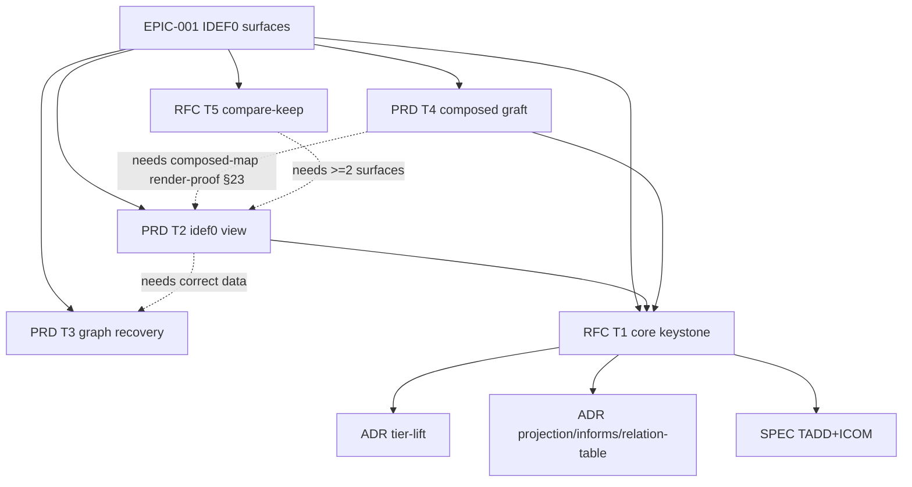

---
assigned_number: 1
created: 2026-06-30
depth: critical
id: EPIC-001
owner: gogocat
predicted_number: 1
slug: epic-idef0-decomposition-surfaces
status: Draft
target: 2026-H2
title: IDEF0 decomposition surfaces
updated: 2026-06-30
---

# EPIC-001: IDEF0 decomposition surfaces

## Progress (Aggregated)

```
T1 core RFC        ░░░░░░░░░░░░░░░░░░░░░░░░  0/?   (  0%)  draft
T2 idef0 view PRD  ░░░░░░░░░░░░░░░░░░░░░░░░  0/?   (  0%)  draft
T3 graph recovery  ░░░░░░░░░░░░░░░░░░░░░░░░  0/?   (  0%)  draft
T4 composed graft  ░░░░░░░░░░░░░░░░░░░░░░░░  0/?   (  0%)  not started
T5 compare-keep    ░░░░░░░░░░░░░░░░░░░░░░░░  0/?   (  0%)  not started
─────────────────────────────────────────────────
TOTAL                                       0/?   (  0%)  shaping
```

---

## Vision

Сделать очень большие forgeplan-проекты обозримыми через прогрессивное раскрытие
по «высотам» (Epic → PRD → RFC → ниже), используя грамматику IDEF0 (ICOM-стрелки,
декомпозиция, A-нумерация), построенную на **одном чистом ядре декомпозиции**, к
которому подключается несколько хостов-рендереров.

## Outcomes (Measurable)

1. **Index fidelity**: доля рёбер источника истины, видимых движку графа →
   индексировано/декларировано в md ≈ **100%** (baseline на 2026-06-30: **49/113 = 43%**;
   структурный спайн `based_on`+`refines`: **8/22 = 36%**).
2. **Real decomposition depth**: на dogfood-воркспейсе ForgePlanWeb видна **подлинная**
   (авторизованная, не выведенная) глубина **≥ 3** (Epic→PRD→RFC/Spec), при baseline = 2.
3. **Comprehension**: время локализации «где живёт артефакт X» в проекте на ≥56 артефактов
   измеримо ниже, чем в любом из 7 существующих видов (метод и порог — в T5-RFC).
4. **Scale**: интерактивный бюджет кадра сохраняется при **N ≥ 1000** артефактов
   (LOD + виртуализация; детерминированная pure-раскладка).
5. **Reuse-not-fork**: **≥ 2** поверхности рендерятся из **одного** ядра
   (`shared/lib/idef0`) без форка алгоритма декомпозиции/ICOM (проверяется тестом, что
   builders/diagram/classifyIcom не дублируются в хостах).
6. **Honesty**: ни одна поверхность не рисует synthetic/derived структуру как реальную —
   real = solid, derived = dashed `≈`; density-gate < порога честно деградирует в
   tier-stack (проверяется на тонком воркспейсе).

## Problem Space

Семь существующих видов графа (Force/Radial/Tree/Sunburst/Matrix/Lanes/Sankey) хорошо
показывают связи, но **не дают читаемой декомпозиции по высотам** и плохо масштабируются
на очень большие проекты — нет «altitude»-навигации «сверху вниз, слой за слоем».

Глубже лежит **проблема данных, объединяющая весь эпик**: lance-индекс, который читают
ВСЕ виды, расходится с markdown-источником истины — рендерит **49 из 113** декларированных
рёбер и обрывает структурный спайн (`based_on`+`refines`: **8 из 22**). Поэтому даже
существующие виды показывают неполный граф, а любая новая декомпозиция была бы на ~76%
выведена эвристически. Эти проблемы нужно решать **вместе**: восстановление и авторинг
графа (T3) — это множитель, который чинит и 7 текущих видов, и все новые поверхности
одновременно. Единое ядро (T1) гарантирует, что несколько поверхностей-кандидатов
строятся из одной проверенной логики, а не форкают её.

## Scope

### In Scope
- **T1** — чистое детерминированное ядро декомпозиции (`shared/lib/idef0`): вывод дерева,
  ICOM-классификация отношений, раскладка ≤6-боксов, density-gate, структурная сигнатура.
- **T2** — отдельный 9-й вид `idef0` (outline + ICOM-диаграмма) на существующем dual-poller.
- **T3** — recover-then-author графа: реиндекс (коррекция индекс↔источник) + авторинг
  реального спайна + минт настоящих Epic'ов с evidence.
- **T4** — графт IDEF0-грамматики на планируемый composed-map (`docs/PROJECT-MAP-SPEC.md`
  §23) + `/onboard`-тур/чат/append-loop.
- **T5** — compare-and-keep: сравнение поверхностей-кандидатов и выбор лучших по UX-качеству.
- Дополнительные поверхности-builders над тем же ядром (Mechanism Atlas, ASSAY, Throughline,
  Waterline) — first-class, co-design в core-RFC.
- Honesty-инварианты, framing (постоянная ICOM-легенда), a11y (клавиатура, reduced-motion),
  token-only dual-theme.

### Out of Scope
- Любая мутация forgeplan из браузера — `/api/*` остаётся read-only proxy (rule 22).
- Генерация «фейковой» структуры ради красивого рендера (предпочитаем authored-real или
  честно-derived-marked).
- Внутренности marketplace-картографа (`forgeplan-map-pack`, отдельный репо) — здесь только
  контракт/интерфейс; код эмиттера живёт там.
- Замена или регрессия 7 существующих видов — они остаются целыми.

## Children (PRDs, RFCs, ADRs)

| Type | ID | Title | Status | Track |
|------|------|-------|--------|-------|
| RFC  | (планируется, keystone) | shared TADD decomposition core (`shared/lib/idef0`) | Draft | T1 |
| ADR  | (планируется) | tier-vocabulary lift → `shared/lib/tier` (behavior-preserving) | Draft | T1 |
| ADR  | (планируется) | `idef0` = IDEF0-STYLE projection, не conformant model; `informs`=Mechanism; локальная relation→ICOM таблица | Draft | T1/T2 |
| SPEC | (планируется) | TADD derivation + ICOM-grammar conformance (сценарии) | Draft | T1 |
| PRD  | (планируется) | Graph spine recovery & enrichment | Draft | T3 |
| PRD  | (планируется) | Standalone `idef0` decomposition view (9th) | Draft | T2 |
| PRD  | (планируется) | Composed-map IDEF0 graft + onboarding | Draft | T4 |
| RFC  | (планируется) | Compare-and-keep surface-selection harness | Draft | T5 |
| PRD/RFC | (deferred) | Builder surfaces: Mechanism Atlas · ASSAY · Throughline · Waterline | — | after-core |

## Dependency Graph



## Phases

### Phase 1: Foundation (data correctness + core)
- **T3-A reindex** (после чистого лендинга PROB-060) — коррекция индекс↔источник; GATE-0.
- RFC T1 (core, keystone) → ADR tier-lift → ADR projection/relation-table → SPEC TADD+ICOM.

### Phase 2: First surface + real depth
- PRD T2 → 9-й вид `idef0` (outline + ICOM, density honest-fallback, ICOM-легенда). GATE-A.
- **T3-B/C** — авторинг реального `refines`-спайна + минт 4–5 настоящих Epic'ов с evidence. GATE-B.

### Phase 3: Graft + additional surfaces
- §23 composed-map render-proof → PRD T4 графт + `/onboard`. Подключить marketplace-репо. GATE-C.
- Builders: Mechanism Atlas (solid day-0), ASSAY, Throughline.

### Phase 4: Selection
- RFC T5 → compare-and-keep harness (3-pane MosaicCanvas, kill-criteria ДО рендер-LOC). GATE-D.

## Risks

| Risk | Impact | Mitigation |
|------|--------|------------|
| reindex на merge-дублированной ветке молча перезаписывает коллизионный артефакт | High | Сначала залендить PROB-060; реиндекс на чистом дереве; сверка count до/после |
| tier-lift молча сдвигает altitude всех hierarchical-видов | High | ADR + **byte-identical** regression-тест на `compactTierMap` до миграции |
| `based_on` исчезает через inverting-default `normaliseHierarchyEdge` | High | Локальная `idef0-relation.ts` с явным case на каждое отношение; fixture из `graph --json` |
| авторинг T3-B/C создаёт фейковую структуру ради вида | Med | Авторить `refines` только где тело RFC реально выводит PRD; иначе honest-derived `≈` |
| T4 строится под несуществующий composed-map | High | GATE-C: не строим рендерер, пока картограф не эмитит реальный `map.json` |
| минт Epic'ов стартует как blindspot (R_eff-долг) | Med | ≥1 evidence на Epic перед активацией; rule 11 не мержит без R_eff>0 |

## Timeline

| Phase | Status |
|-------|--------|
| Phase 1 Foundation | Shaping |
| Phase 2 First surface | Not Started |
| Phase 3 Graft + surfaces | Not Started |
| Phase 4 Selection | Not Started |

## Implementation Log

<!-- Заполняется по мере закрытия фаз. -->

## Related

- `docs/PROJECT-MAP-SPEC.md` §23 — composed-map / onboard / tour / chat / append-loop (хост T4).
- PROB-060 (`feat/prob-060-snapshot-identity`) — должен залендиться до T3-A reindex.
- Design provenance: workflows `wf_6b6f2592-b38` (9th-view, 26 агентов) + `wf_517413f9-758`
  (program, 9 агентов), эта сессия.


