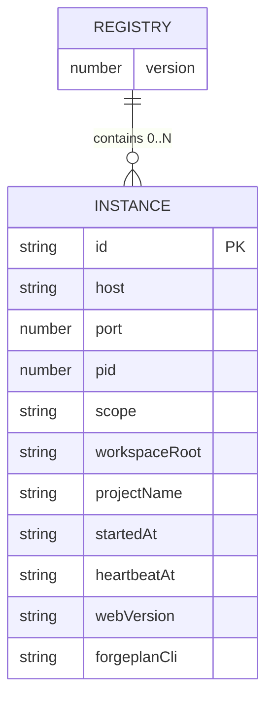

---
id: SPEC-003
title: "Instance registry JSON schema (~/.forgeplan-web/instances.json)"
status: Draft
author: docs-eng-109
created: 2026-05-08
updated: 2026-05-08
prd: PRD-027
type: Data Model
depth: standard
---

# SPEC-003: Instance registry JSON schema (~/.forgeplan-web/instances.json)

## Summary

Authoritative JSON schema for the multi-instance registry file
(`~/.forgeplan-web/instances.json`) used by PRD-027's port-coordination
and PRD-029's instance switcher. Schema version 1.

## Scope

Owns:

- File path convention: `~/.forgeplan-web/instances.json` (locked by
  ADR-004, mirrors PRD-025 user-scope path).
- Top-level `Registry` shape and version field.
- `Instance` row shape and field-level constraints.
- Side-effects table (`registry.write`, `registry.invalidate`,
  `instance.deregister`).
- Versioning policy.

Does NOT own:

- Read/write algorithms — see RFC-023.
- API endpoint contract — `/api/instances` envelope is documented
  inline below for cross-reference but the read-only proxy invariant
  belongs to rule 22 (amended in PRD-029).
- Liveness semantics — see RFC-023.

## Data Models

### Registry (top-level)

```typescript
interface Registry {
  /**
   * Schema version. Bumped on breaking field rename / removal.
   * Readers MUST treat unknown versions as empty (recover gracefully).
   */
  version: 1;

  /**
   * Currently-known instances. Order is not significant; readers
   * sort by `port` for display when needed.
   */
  instances: Instance[];
}
```

### Instance (per-row)

```typescript
interface Instance {
  /**
   * Stable identity for the running instance. Format is `host:port`,
   * e.g. "127.0.0.1:5174". Used as primary key — duplicate rows with
   * the same id MUST be deduped by writers (last-writer-wins).
   */
  id: string;

  /** Bind host. Typically "127.0.0.1". MUST be a valid IP literal or hostname. */
  host: string;

  /** TCP port. MUST be in [1024, 65535]. */
  port: number;

  /** OS process id. MUST be a positive integer. */
  pid: number;

  /** Scope under which the scaffold was installed. */
  scope: 'user' | 'project';

  /**
   * Absolute path to the Forgeplan workspace this instance serves.
   * Equals FORGEPLAN_CWD passed to the SvelteKit server.
   */
  workspaceRoot: string;

  /**
   * Human-friendly project label. By convention: `path.basename(workspaceRoot)`,
   * or the git remote name when detectable. MUST be 1-128 chars.
   */
  projectName: string;

  /** ISO 8601 timestamp when the instance was registered. Immutable for the row's lifetime. */
  startedAt: string;

  /** ISO 8601 timestamp last refreshed by the heartbeat (every 30s, see RFC-023). */
  heartbeatAt: string;

  /** @forgeplan/web package version reported at start time. e.g. "0.1.14". */
  webVersion: string;

  /**
   * forgeplan CLI version detected at start time. May be null if the
   * binary was unavailable when start ran (rare; init normally fails first).
   */
  forgeplanCli: string | null;
}
```

**Constraints**:

- `id` MUST equal `${host}:${port}` (writer invariant; readers MAY trust).
- `port`: 1024-65535.
- `pid`: > 0.
- `startedAt`, `heartbeatAt`: ISO 8601 with timezone (e.g. trailing `Z` or `+HH:MM`).
- `workspaceRoot`: absolute path; MUST exist at write time.
- `projectName`: 1-128 chars.
- `scope`: enum `'user' | 'project'`.

## Validation Rules

| Field | Rule | Error message |
|-------|------|---------------|
| `version` | Must be exactly `1` | `unsupported registry version: <n>` |
| `instances` | Must be an array | `instances must be an array` |
| `id` | Must match `^[A-Za-z0-9.\-_:]+:[0-9]+$` | `invalid instance id: <id>` |
| `id` | Must equal `${host}:${port}` | `instance id must be <host>:<port>` |
| `host` | Non-empty string | `host required` |
| `port` | Integer in [1024, 65535] | `port out of range: <port>` |
| `pid` | Positive integer | `invalid pid: <pid>` |
| `scope` | One of `user` / `project` | `unknown scope: <scope>` |
| `workspaceRoot` | Absolute path | `workspaceRoot must be absolute` |
| `projectName` | String, 1-128 chars | `projectName length out of range` |
| `startedAt` | Parseable ISO 8601 | `invalid startedAt: <value>` |
| `heartbeatAt` | Parseable ISO 8601 | `invalid heartbeatAt: <value>` |
| `webVersion` | Non-empty string (semver-shaped) | `webVersion required` |
| `forgeplanCli` | String or null | `forgeplanCli must be string or null` |

Readers SHOULD log a warning on validation failure but treat the row
as if it were absent (dropping it from the live view). This keeps
forgeplan-web resilient to partially-corrupt registries.

## Relationships



## Events / Side Effects

Writers MUST emit one of these logical events per state change. The
events are not transported anywhere yet (no event bus in MVP); they are
named here so future tooling (`forgeplan-web doctor`, audit logs) can
hook in without re-naming.

| Trigger | Event | Producers | Consumers |
|---------|-------|-----------|-----------|
| New instance appended | `registry.write` (op: `append`) | `bin/commands/start.mjs` after port-bind | (none in MVP; future doctor) |
| Heartbeat refresh | `registry.write` (op: `heartbeat`) | `template/src/shared/server/heartbeat.ts` setInterval | (none) |
| Stale row removed during sweep | `registry.invalidate` | `bin/lib/registry.mjs#sweepStale` (called by `appendInstance`) | (none) |
| Graceful exit | `instance.deregister` | `bin/commands/start.mjs` SIGINT/SIGTERM/beforeExit handler | (none) |
| Crash (SIGKILL) | (no event; row stays until next sweep) | n/a | sweep on next `start` |
| Manual file delete | (silently re-created on next write) | n/a | n/a |

## API Surface (cross-reference)

The endpoint `GET /api/instances` (defined by RFC-025) returns:

```json
{
  "ok": true,
  "data": {
    "instances": [
      {
        "id": "127.0.0.1:5174",
        "host": "127.0.0.1",
        "port": 5174,
        "pid": 12345,
        "scope": "user",
        "workspaceRoot": "/Users/me/proj-a",
        "projectName": "proj-a",
        "startedAt": "2026-05-08T19:00:00.000Z",
        "heartbeatAt": "2026-05-08T19:00:30.000Z",
        "webVersion": "0.1.14",
        "forgeplanCli": "0.27.0"
      }
    ]
  }
}
```

On error: `{ "ok": false, "error": "...", "data": { "instances": [] } }`.

## Versioning

| Version | Date | Changes |
|---------|------|---------|
| 1 | 2026-05-08 | Initial schema. Fields: id, host, port, pid, scope, workspaceRoot, projectName, startedAt, heartbeatAt, webVersion, forgeplanCli. |

**Bump policy**:

- Breaking change (field rename, removal, type change) → `version: 2`.
  Readers MUST treat unknown versions as empty registry. Writers MUST
  refuse to write a `version: 1` payload after bumping.
- Additive change (new optional field) → no bump; old readers ignore
  unknown fields.
- Reading a `version: 0` or absent — treat as empty (forward-only
  migration).

## Related

- PRD-027 — multi-instance registry product spec
- RFC-023 — read/write algorithms, port allocator, liveness probe
- RFC-025 — `/api/instances` endpoint contract
- ADR-004 — registry path & format decision
- PRD-029 — HealthBar instance switcher (consumer)
- GitHub #113 — source sub-issue

---

> **Next step**: Land alongside RFC-023. PRD-029 consumes the API surface defined here.


